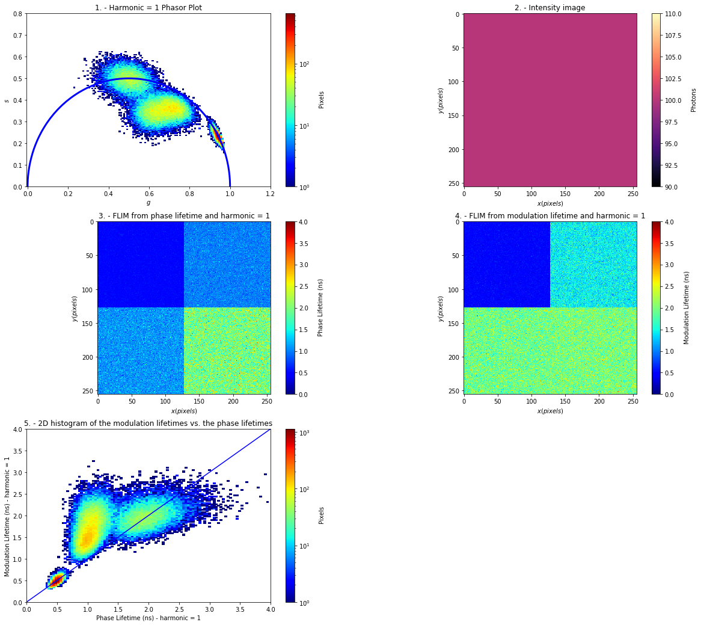
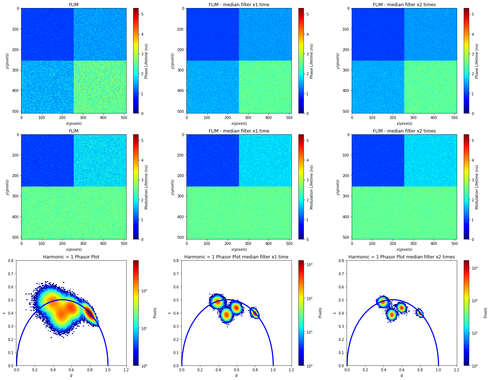

# FLIM-Phasors simulator v2.0

With the FLIM-Phasors simulator it is possible to create FLIM images and display them along with the associated [phasor plot](#phasor_plotting).

Four types of function are available in this second release for creating artificial FLIM datasets:

1. [**half_image**](#half_image) function produces an image made up my two subimages having equal intensities but different lifetimes &tau;<sub>1</sub> and &tau;<sub>2</sub>


*Fig.1 - half_image output having &tau;<sub>1</sub> and &tau;<sub>2</sub> subimages*

2. [**quarter_image**](#quarter_image) function produces an image made up my four subimages having equal intensities but different lifetimes - see [**Example 1**](#example-1).


*Fig.2 - quarter_image function output having four subimages*


3. [**band_image**](#band_image) function produces an image divided in a n number of bands having equal intensities but different lifetimes - see [**Example 2**](#example-2).


*Fig.3 - band_image function output*


4. [**stripe_image**](#stripe_image) function produces an image divided in a n number of stripes having equal intensities but different lifetimes - see [**Example 3**](#example-3).


*Fig.3 - stripe_image function output*


This simulator allows also to explore the [median filter function](#median_filtering) to boost phasors accuracy.

A jupyter notebook of the FLIM-Phasors simulator is available here [FLIM-Phasors simulator](https://github.com/FLIMLABS/FLIM-Phasors-simulator/blob/main/FLIM-Phasors%20simulator.ipynb) but, for immediate reference, its content is reported below:


Needed libraries


```python
%pylab inline
import numpy as np
import matplotlib.pyplot as plt
from numpy import *
from matplotlib import colors
from scipy import ndimage, misc
```

    Populating the interactive namespace from numpy and matplotlib
    

## Specify parameters

Select the desired fluorescence lifetimes


```python
tau1 = 0.5 # in nanoseconds
tau2 = 2   # in nanoseconds
tau3 = 3   # in nanoseconds
```

Select the laser period


```python
laser_period_in_nanoseconds = 12.5 # in nanoseconds
```

Specify the number of photons per pixel


```python
photons = 100 
```

Select the number of time-bins in the TCSPC histogram


```python
bin_number = 256
```

Select image size


```python
x_dim = 256 # pixels - square image dimension 
y_dim = x_dim # pixels - square image dimension
```

Select harmonic number for the phasor plot


```python
harmonic = 1
```

# Half_image

The **half_image** function below will produce an image made up my two subimages having equal intensities but different lifetimes


**Inputs**
    
1. &tau;<sub>1</sub> - lifetime in nanoseconds
2. &tau;<sub>2</sub> - lifetime in nanoseconds
3. photons - number of photons per pixel
4. laser_period_in_nanoseconds - laser period in nanoseconds
5. harmonic - harmonic number for the phasor plot analysis and representation
6. bin_number - number of time-bins in the TCSPC histogram
7. x_dim - x dimension in pixel of the final image
8. y_dim - y dimension in pixel of the final image
    
    
**Outputs**
    
1. image(x,y,photons) - x pixel, y pixel wide inensity image
2. G(x,y,g) - x pixel, y pixel wide g coordinates for the nth-harmonic phasor plot
3. S(x,y,s) - x pixel, y pixel wide s coordinates for the nth-harmonic phasor plot


```python
def half_image(tau1, tau2, photons, laser_period_in_nanoseconds, harmonic, bin_number, x_dim, y_dim):


    
    # Inputs
    
    # tau1 - lifetime in nanoseconds
    # tau2 - lifetime in nanoseconds
    # photons - number of photons per pixel
    # laser_period_in_nanoseconds - laser period in nanoseconds
    # harmonic - harmonic number for the phasor plot analysis and representation
    # bin_number - number of time-bins in the TCSPC histogram
    # x_dim - x dimension in pixel of the final image
    # y_dim - y dimension in pixel of the final image
    
    
    # Outputs
    
    # image(x,y,photons) - x pixel, y pixel wide inensity image
    # G(x,y,g) - x pixel, y pixel wide g coordinates for the nth-harmonic phasor plot
    # S(x,y,s) - x pixel, y pixel wide s coordinates for the nth-harmonic phasor plot
    
    
    
    # Allocating 2D datasets for the intensity image(x,y,photons), G(x,y,g) and  S(x,y,s)
    image = np.zeros((x_dim,y_dim)) # empty intensity image
    G = np.zeros((x_dim,y_dim))     # empty G matrix for phasors
    S = np.zeros((x_dim,y_dim))     # empty S matrix for phasors

    for i in range(0,int(x_dim/2)):
        for j in range(0,y_dim):

            Y1 = np.random.exponential(tau1, int(photons)) # random exponential distribution having tau as a decay constant
            Y1 = (Y1)%laser_period_in_nanoseconds # using the MOD mathematical operation to constrain photons arrivals within the laser period
            dist1 = np.histogram(Y1, bins=bin_number) # TCSPC histogram calculation
            x1 = dist1[1][0:-1] # x axis values for TCSPC histogram
            y1 = dist1[0]       # y axis values for TCSPC histogram
            sine1 = np.sin(2*np.pi*harmonic*x1/laser_period_in_nanoseconds) # creating sine wave for phasor approach
            cosine1 = np.cos(2*np.pi*harmonic*x1/laser_period_in_nanoseconds) # creating cosine wave for phasor approach
            G[i][j] = (cosine1*y1).sum()/y1.sum() # computing G matrix
            S[i][j] = (sine1*y1).sum()/y1.sum()   # computing S matrix
            image[i][j] = y1.sum()                # computing intensity image

    for i in range(int(x_dim/2),x_dim):
        for j in range(0,y_dim):

            Y1 = np.random.exponential(tau2, int(photons)) # random exponential distribution having tau as a decay constant
            Y1 = (Y1)%laser_period_in_nanoseconds # using the MOD mathematical operation to constrain photons arrivals within the laser period
            dist1 = np.histogram(Y1, bins=bin_number) # TCSPC histogram calculation
            x1 = dist1[1][0:-1] # x axis values for TCSPC histogram
            y1 = dist1[0]       # y axis values for TCSPC histogram
            sine1 = np.sin(2*np.pi*harmonic*x1/laser_period_in_nanoseconds) # creating sine wave for phasor approach
            cosine1 = np.cos(2*np.pi*harmonic*x1/laser_period_in_nanoseconds) # creating cosine wave for phasor approach
            G[i][j] = (cosine1*y1).sum()/y1.sum() # computing G matrix
            S[i][j] = (sine1*y1).sum()/y1.sum()   # computing S matrix
            image[i][j] = y1.sum()                # computing intensity image
        
    return G,S,image
```


Calling **half_image**


```python
G,S,image=half_image(tau1, tau2, photons, laser_period_in_nanoseconds, harmonic, bin_number, x_dim, y_dim)
```

# Phasor_plotting

The **phasor_plotting** function outputs 5 different figures:

1. the [phasor plot](10.1529/biophysj.107.120154)
2. the final intensity image
3. the FLIM image calulated using the lifetime values calculated with the phase
4. the FLIM image calulated using the lifetime values calculated with the modulation
5. a 2D histogram of the modulation lifetimes vs. the phase lifetimes

**Phasor_plotting** I/Os :

**Inputs**

1. image(x,y,photons) - x pixel, y pixel wide inensity image
2. G(x,y,g) - x pixel, y pixel wide g coordinates for the nth-harmonic phasor plot
3. S(x,y,s) - x pixel, y pixel wide s coordinates for the nth-harmonic phasor plot
4. max_lifetime - full-scale maximum lifetime in nanoseconds
5. hist_bins - number of histogram bins for the 2D histogram of the modulation lifetimes vs. the phase lifetimes


**Outputs**

6. tau_m(x,y,lifetime_modulation) - x pixel, y pixel wide lifetime values calculated with the modulation using the nth-harmonic
7. tau_m(x,y,lifetime_phase) - x pixel, y pixel wide lifetime values calculated with the phase using the nth-harmonic


```python
def phasor_plotting(G,S,image,max_lifetime,harmonic,hist_bins=0):
    
    # Inputs
    
    # image(x,y,photons) - x pixel, y pixel wide inensity image
    # G(x,y,g) - x pixel, y pixel wide g coordinates for the nth-harmonic phasor plot
    # S(x,y,s) - x pixel, y pixel wide s coordinates for the nth-harmonic phasor plot
    # max_lifetime - full-scale maximum lifetime in nanoseconds
    # hist_bins - number of histogram bins for the 2D histogram of the modulation lifetimes vs. the phase lifetimes
    
    if (hist_bins==0): # if no hist_bins is specified it is automatically set to 100
        hist_bins=100

    
    
    # Outputs
    
    # tau_m(x,y,lifetime_modulation) - x pixel, y pixel wide lifetime values calculated with the modulation using the nth-harmonic
    # tau_m(x,y,lifetime_phase) - x pixel, y pixel wide lifetime values calculated with the phase using the nth-harmonic

    
    fig = plt.figure(figsize=(20,18))

    # Phasor plot
    plt.subplot(3,2,1)
    k= np.asarray(G).reshape(-1)
    v= np.asarray(S).reshape(-1)

    plt.hist2d(k, v,bins = 100, cmap = 'jet', norm = colors.LogNorm()) 

    title = "1. - Harmonic = "+str(harmonic)+" Phasor Plot"
    plt.title(title)
    plt.xlabel('$g$')
    plt.ylabel('$s$')

    cbar = plt.colorbar()
    cbar.ax.set_ylabel('\n Pixels')


    plt.xlim([-0.005,1.2])
    plt.ylim([0,0.8])
    x = np.linspace(-1.0, 1.0, 100)
    y = np.linspace(-1.0, 1.0, 100)
    X, Y = np.meshgrid(x,y)
    F = (X**2 + Y**2 - X)
    plt.contour(X,Y,F,[0],colors='b',linewidths=3)

    
    # Intensity image
    plt.subplot(3,2,2)
    plt.imshow(image,cmap='magma')
    title = "2. - Intensity image"
    plt.title(title)
    plt.xlabel('$x (pixels) $')
    plt.ylabel('$y (pixels) $')
    cbar = plt.colorbar()
    cbar.ax.set_ylabel('\n Photons')

    # Phase lifetime
    tau_p = (laser_period_in_nanoseconds/(2*np.pi*harmonic))*(S/G) # calculation of lifetime using the phase
    plt.subplot(3,2,3)
    
    # FLIM from phase lifetime
    plt.imshow(tau_p, vmin = 0, vmax = max_lifetime, cmap='jet')
    title = "3. - FLIM from phase lifetime and harmonic = "+str(harmonic)
    plt.title(title)
    plt.xlabel('$x (pixels) $')
    plt.ylabel('$y (pixels) $')

    cbar = plt.colorbar()
    cbar.ax.set_ylabel('\n Phase Lifetime (ns)')

    # Modulation lifetime
    tau_m = (laser_period_in_nanoseconds/(2*np.pi*harmonic))*np.sqrt((1/(S*S+G*G))-1) # calculation of lifetime using the modulation
    plt.subplot(3,2,4)
    
    # FLIM from modulation lifetime
    plt.imshow(tau_m, vmin = 0, vmax = max_lifetime, cmap='jet')
    title = "4. - FLIM from modulation lifetime and harmonic = "+str(harmonic)
    plt.title(title)
    plt.xlabel('$x (pixels) $')
    plt.ylabel('$y (pixels) $')

    cbar = plt.colorbar()
    cbar.ax.set_ylabel('\n Modulation Lifetime (ns)')


    plt.subplot(3,2,5)
    
    modulations= np.asarray(tau_m).reshape(-1)
    phases= np.asarray(tau_p).reshape(-1)

    plt.hist2d(phases,modulations,bins = hist_bins, cmap = 'jet', norm = colors.LogNorm()) 

    limit = max_lifetime

    u = [0, limit]
    v = [0, limit]
    plt.plot(u,v,'b',markersize=3)
    plt.xlim([0,limit])
    plt.ylim([0,limit])
    title = "5. - 2D histogram of the modulation lifetimes vs. the phase lifetimes"
    plt.title(title)
    plt.ylabel('Modulation Lifetime (ns) - harmonic = '+str(harmonic))
    plt.xlabel('Phase Lifetime (ns) - harmonic = '+str(harmonic))
    cbar = plt.colorbar()
    l=cbar.ax.set_ylabel('\n Pixels')
    
    return tau_m,tau_p
```

Calling **phasor_plotting**


```python
max_lifetime = tau3 + 1
tau_m,tau_p = phasor_plotting(G,S,image,max_lifetime,harmonic)
```


# Median_filtering

The **median_filtering** function will ouput median filtered version of the FLIM images calculated both with phase and modulation respectively. x1 and x2 times median filter outputs are shown
- [Phasor plot and median filtering](https://escholarship.org/content/qt5g279175/qt5g279175.pdf)

```python
def median_filtering(G,S,max_lifetime, harmonic):
    
    # Median filter x1 time
    G_result = ndimage.median_filter(G, size=3) # applying a 3x3 pixels median filter on G matrix x1 time
    S_result = ndimage.median_filter(S, size=3) # applying a 3x3 pixels median filter on S matrix x1 time
    
    # Median filter x2 times
    G_result2 = ndimage.median_filter(G_result, size=3) # applying a 3x3 pixels median filter on G matrix x2 times
    S_result2 = ndimage.median_filter(S_result, size=3) # applying a 3x3 pixels median filter on S matrix x2 times

    fig = plt.figure(figsize=(23,18))

    # Phase lifetime with G,S
    tau_p = (laser_period_in_nanoseconds/(2*np.pi*harmonic))*(S/G)
    plt.subplot(3,3,1),plt.imshow(tau_p, vmin = 0, vmax = max_lifetime, cmap='jet')
    title = "FLIM"
    plt.title(title)
    plt.xlabel('$x (pixels) $')
    plt.ylabel('$y (pixels) $')
    cbar = plt.colorbar()
    cbar.ax.set_ylabel('Phase Lifetime (ns)')

    # Phase lifetime with G,S after x1 time median filter
    tau_p = (laser_period_in_nanoseconds/(2*np.pi*harmonic))*(S_result/G_result)
    plt.subplot(3,3,2),plt.imshow(tau_p, vmin = 0, vmax = max_lifetime, cmap='jet')
    title = "FLIM - median filter x1 time"
    plt.title(title)
    plt.xlabel('$x (pixels) $')
    plt.ylabel('$y (pixels) $')
    cbar = plt.colorbar()
    cbar.ax.set_ylabel('Phase Lifetime (ns)')

    # Phase lifetime with G,S after x2 times median filter
    tau_p = (laser_period_in_nanoseconds/(2*np.pi*harmonic))*(S_result2/G_result2)
    plt.subplot(3,3,3),plt.imshow(tau_p, vmin = 0, vmax = max_lifetime, cmap='jet')
    title = "FLIM - median filter x2 times"
    plt.title(title)
    plt.xlabel('$x (pixels) $')
    plt.ylabel('$y (pixels) $')
    cbar = plt.colorbar()
    cbar.ax.set_ylabel('Phase Lifetime (ns)')

    # Modulation lifetime with G,S
    tau_m = (laser_period_in_nanoseconds/(2*np.pi*harmonic))*np.sqrt((1/(S*S+G*G))-1)
    plt.subplot(3,3,4),plt.imshow(tau_m, vmin = 0, vmax = max_lifetime, cmap='jet')
    title = "FLIM"
    plt.title(title)
    plt.xlabel('$x (pixels) $')
    plt.ylabel('$y (pixels) $')
    cbar = plt.colorbar()
    cbar.ax.set_ylabel('Modulation Lifetime (ns)')

    # Modulation lifetime with G,S after x1 time median filter
    tau_m = (laser_period_in_nanoseconds/(2*np.pi*harmonic))*np.sqrt((1/(S_result*S_result+G_result*G_result))-1)
    plt.subplot(3,3,5),plt.imshow(tau_m, vmin = 0, vmax = max_lifetime, cmap='jet')
    title = "FLIM - median filter x1 time"
    plt.title(title)
    plt.xlabel('$x (pixels) $')
    plt.ylabel('$y (pixels) $')
    cbar = plt.colorbar()
    cbar.ax.set_ylabel('Modulation Lifetime (ns)')

    # Modulation lifetime with G,S after x2 times median filter
    tau_m = (laser_period_in_nanoseconds/(2*np.pi*harmonic))*np.sqrt((1/(S_result2*S_result2+G_result2*G_result2))-1)
    plt.subplot(3,3,6),plt.imshow(tau_m, vmin = 0, vmax = max_lifetime, cmap='jet')
    title = "FLIM - median filter x2 times"
    plt.title(title)
    plt.xlabel('$x (pixels) $')
    plt.ylabel('$y (pixels) $')
    cbar = plt.colorbar()
    l=cbar.ax.set_ylabel('Modulation Lifetime (ns)')
    
    
    # Phasor plot
    k= np.asarray(G).reshape(-1)
    v= np.asarray(S).reshape(-1)

    plt.subplot(3,3,7),plt.hist2d(k, v,bins = 100, cmap = 'jet', norm = colors.LogNorm()) 

    title = "Harmonic = "+str(harmonic)+" Phasor Plot"
    plt.title(title)
    plt.xlabel('$g$')
    plt.ylabel('$s$')

    cbar = plt.colorbar()
    cbar.ax.set_ylabel('\n Pixels')


    plt.xlim([-0.005,1.2])
    plt.ylim([0,0.8])
    x = np.linspace(-1.0, 1.0, 100)
    y = np.linspace(-1.0, 1.0, 100)
    X, Y = np.meshgrid(x,y)
    F = (X**2 + Y**2 - X)
    plt.contour(X,Y,F,[0],colors='b',linewidths=3)
    
    # Phasor plot x1 time median filter
    k= np.asarray(G_result).reshape(-1)
    v= np.asarray(S_result).reshape(-1)

    plt.subplot(3,3,8),plt.hist2d(k, v,bins = 100, cmap = 'jet', norm = colors.LogNorm()) 

    title = "Harmonic = "+str(harmonic)+" Phasor Plot median filter x1 time"
    plt.title(title)
    plt.xlabel('$g$')
    plt.ylabel('$s$')

    cbar = plt.colorbar()
    cbar.ax.set_ylabel('\n Pixels')


    plt.xlim([-0.005,1.2])
    plt.ylim([0,0.8])
    x = np.linspace(-1.0, 1.0, 100)
    y = np.linspace(-1.0, 1.0, 100)
    X, Y = np.meshgrid(x,y)
    F = (X**2 + Y**2 - X)
    plt.contour(X,Y,F,[0],colors='b',linewidths=3)
    
    # Phasor plot x2 times median filter
    k= np.asarray(G_result2).reshape(-1)
    v= np.asarray(S_result2).reshape(-1)

    plt.subplot(3,3,9),plt.hist2d(k, v,bins = 100, cmap = 'jet', norm = colors.LogNorm()) 

    title = "Harmonic = "+str(harmonic)+" Phasor Plot median filter x2 times"
    plt.title(title)
    plt.xlabel('$g$')
    plt.ylabel('$s$')

    cbar = plt.colorbar()
    cbar.ax.set_ylabel('\n Pixels')


    plt.xlim([-0.005,1.2])
    plt.ylim([0,0.8])
    x = np.linspace(-1.0, 1.0, 100)
    y = np.linspace(-1.0, 1.0, 100)
    X, Y = np.meshgrid(x,y)
    F = (X**2 + Y**2 - X)
    plt.contour(X,Y,F,[0],colors='b',linewidths=3)
    
    return
```

Calling **median_filtering**


```python
median_filtering(G,S,max_lifetime,harmonic)
```


# Quarter_image

The **quarter_image** will produce an image made up my four subimages having equal intensities but different lifetimes.

- **1st** subimage - &tau;<sub>1</sub>

- **2nd** subimage - 50% &tau;<sub>1</sub> and 50% &tau;<sub>3</sub>

- **3rd** subimage - 50% &tau;<sub>1</sub> and 50% &tau;<sub>2</sub>

- **4th** subimage - &tau;<sub>2</sub>


**Inputs**
    
1. &tau;<sub>1</sub> - lifetime in nanoseconds
2. &tau;<sub>2</sub> - lifetime in nanoseconds
3. &tau;<sub>3</sub> - lifetime in nanoseconds
4. photons - number of photons per pixel
5. laser_period_in_nanoseconds - laser period in nanoseconds
6. harmonic - harmonic number for the phasor plot analysis and representation
7. bin_number - number of time-bins in the TCSPC histogram
8. x_dim - x dimension in pixel of the final image
9. y_dim - y dimension in pixel of the final image
    
    
**Outputs**
    
1. image(x,y,photons) - x pixel, y pixel wide inensity image
2. G(x,y,g) - x pixel, y pixel wide g coordinates for the nth-harmonic phasor plot
3. S(x,y,s) - x pixel, y pixel wide s coordinates for the nth-harmonic phasor plot


```python
def quarter_image(tau1, tau2, tau3, photons, laser_period_in_nanoseconds, harmonic, bin_number, x_dim, y_dim):
    
    # Inputs
    
    # tau1 - lifetime in nanoseconds
    # tau2 - lifetime in nanoseconds
    # tau3 - lifetime in nanoseconds
    # photons - number of photons per pixel
    # laser_period_in_nanoseconds - laser period in nanoseconds
    # harmonic - harmonic number for the phasor plot analysis and representation
    # bin_number - number of time-bins in the TCSPC histogram
    # x_dim - x dimension in pixel of the final image
    # y_dim - y dimension in pixel of the final image
    
    
    # Outputs
    
    # image(x,y,photons) - x pixel, y pixel wide inensity image
    # G(x,y,g) - x pixel, y pixel wide g coordinates for the nth-harmonic phasor plot
    # S(x,y,s) - x pixel, y pixel wide s coordinates for the nth-harmonic phasor plot
    
    
    
    # Allocating 2D datasets for the intensity image(x,y,photons), G(x,y,g) and  S(x,y,s)
    image = np.zeros((x_dim,y_dim)) # empty intensity image
    G = np.zeros((x_dim,y_dim))     # empty G matrix for phasors
    S = np.zeros((x_dim,y_dim))     # empty S matrix for phasors
    

    
    for i in range(0,int(x_dim/2)):
        for j in range(0,int(y_dim/2)):

            Y1 = np.random.exponential(tau1, int(photons)) # random exponential distribution having tau as a decay constant
            Y1 = (Y1)%laser_period_in_nanoseconds # using the MOD mathematical operation to constrain photons arrivals within the laser period
            dist1 = np.histogram(Y1, bins=bin_number) # TCSPC histogram calculation
            x1 = dist1[1][0:-1] # x axis values for TCSPC histogram
            y1 = dist1[0]       # y axis values for TCSPC histogram
            sine1 = np.sin(2*np.pi*harmonic*x1/laser_period_in_nanoseconds) # creating sine wave for phasor approach
            cosine1 = np.cos(2*np.pi*harmonic*x1/laser_period_in_nanoseconds) # creating cosine wave for phasor approach
            G[i][j] = (cosine1*y1).sum()/y1.sum() # computing G matrix
            S[i][j] = (sine1*y1).sum()/y1.sum()   # computing S matrix
            image[i][j] = y1.sum()                # computing intensity image

    for i in range(0,int(x_dim/2)):
        for j in range(int(y_dim/2),y_dim):

            Y1 = np.random.exponential(tau1, int(photons/2)) # random exponential distribution having tau as a decay constant
            Y1 = (Y1)%laser_period_in_nanoseconds # using the MOD mathematical operation to constrain photons arrivals within the laser period
            Y2 = np.random.exponential(tau2, int(photons/2)) # random exponential distribution having tau as a decay constant
            Y2 = (Y2)%laser_period_in_nanoseconds # using the MOD mathematical operation to constrain photons arrivals within the laser period
            Y = np.concatenate((Y1, Y2)) # concatenating Y1 and Y2 distribution to get a double lifetine specie fluorescence decay
            # the two species are mixed as their ratio is 1:1
            dist1 = np.histogram(Y, bins=bin_number)
            x1 = dist1[1][0:-1] # x axis values for TCSPC histogram
            y1 = dist1[0]       # y axis values for TCSPC histogram
            sine1 = np.sin(2*np.pi*harmonic*x1/laser_period_in_nanoseconds) # creating sine wave for phasor approach
            cosine1 = np.cos(2*np.pi*harmonic*x1/laser_period_in_nanoseconds) # creating cosine wave for phasor approach
            G[i][j] = (cosine1*y1).sum()/y1.sum() # computing G matrix
            S[i][j] = (sine1*y1).sum()/y1.sum()   # computing S matrix
            image[i][j] = y1.sum()                # computing intensity image

    for i in range(int(x_dim/2),x_dim):
        for j in range(int(y_dim/2),y_dim):

            Y1 = np.random.exponential(tau2, int(photons)) # random exponential distribution having tau as a decay constant
            Y1 = (Y1)%laser_period_in_nanoseconds # using the MOD mathematical operation to constrain photons arrivals within the laser period
            dist1 = np.histogram(Y1, bins=bin_number) # TCSPC histogram calculation
            x1 = dist1[1][0:-1] # x axis values for TCSPC histogram
            y1 = dist1[0]       # y axis values for TCSPC histogram
            sine1 = np.sin(2*np.pi*harmonic*x1/laser_period_in_nanoseconds) # creating sine wave for phasor approach
            cosine1 = np.cos(2*np.pi*harmonic*x1/laser_period_in_nanoseconds) # creating cosine wave for phasor approach
            G[i][j] = (cosine1*y1).sum()/y1.sum() # computing G matrix
            S[i][j] = (sine1*y1).sum()/y1.sum()   # computing S matrix
            image[i][j] = y1.sum()                # computing intensity image

    for i in range(int(x_dim/2),x_dim):
        for j in range(0,int(y_dim/2)):

            Y1 = np.random.exponential(tau1, int(photons/2)) # random exponential distribution having tau as a decay constant
            Y1 = (Y1)%laser_period_in_nanoseconds # using the MOD mathematical operation to constrain photons arrivals within the laser period
            Y2 = np.random.exponential(tau3, int(photons/2)) # random exponential distribution having tau as a decay constant
            Y2 = (Y2)%laser_period_in_nanoseconds # using the MOD mathematical operation to constrain photons arrivals within the laser period
            Y = np.concatenate((Y1, Y2)) # concatenating Y1 and Y2 distribution to get a double lifetine specie fluorescence decay
            # the two species are mixed as their ratio is 1:1
            dist1 = np.histogram(Y, bins=bin_number)
            x1 = dist1[1][0:-1] # x axis values for TCSPC histogram
            y1 = dist1[0]       # y axis values for TCSPC histogram
            sine1 = np.sin(2*np.pi*harmonic*x1/laser_period_in_nanoseconds) # creating sine wave for phasor approach
            cosine1 = np.cos(2*np.pi*harmonic*x1/laser_period_in_nanoseconds) # creating cosine wave for phasor approach
            G[i][j] = (cosine1*y1).sum()/y1.sum() # computing G matrix
            S[i][j] = (sine1*y1).sum()/y1.sum()   # computing S matrix
            image[i][j] = y1.sum()                # computing intensity image

    return G,S,image
```

Calling **quarter_image**


```python
G,S,image=quarter_image(tau1, tau2, tau3, photons, laser_period_in_nanoseconds, harmonic, bin_number, x_dim, y_dim)
```

Calling **phasor_plotting** and **median_filtering**


```python
tau_m,tau_p = phasor_plotting(G,S,image,max_lifetime,harmonic)
median_filtering(G,S,max_lifetime,harmonic)
```





# Example 1


```python
tau1 = 1
tau2 = 2.5
tau3 = 4.3

photons = 120
laser_period_in_nanoseconds = 12.5
harmonic = 1
x_dim = 512
y_dim = x_dim
max_lifetime = tau3 + 1
```


```python
G,S,image=quarter_image(tau1, tau2, tau3, photons, laser_period_in_nanoseconds, harmonic, bin_number, x_dim, y_dim)
tau_m,tau_p = phasor_plotting(G,S,image,max_lifetime,harmonic)
median_filtering(G,S,max_lifetime,harmonic)
```





# Band_image

The **band_image** will produce an image divided in a n number of bands having equal intensities but different lifetimes.

Lifetime values are internally and randomly generated by the function itself and get printed as output for the user.


**Inputs**
    

1. image_bands - number of region in which the image should be sub-divided
2. photons - number of photons per pixel
3. laser_period_in_nanoseconds - laser period in nanoseconds
4. min_lifetime - minimum lifetime value that can be randomly generated
5. max_lifetime - maximum lifetime value that can be randomly generated
6. harmonic - harmonic number for the phasor plot analysis and representation
7. bin_time_width_in_ps - width in time of the TCSPC histogram bins
8. x_dim - x dimension in pixel of the final image
9. y_dim - y dimension in pixel of the final image
    
    
**Outputs**
    
1. image(x,y,photons) - x pixel, y pixel wide inensity image
2. G(x,y,g) - x pixel, y pixel wide g coordinates for the nth-harmonic phasor plot
3. S(x,y,s) - x pixel, y pixel wide s coordinates for the nth-harmonic phasor plot


```python
def band_image(image_bands, photons, laser_period_in_nanoseconds, min_lifetime, max_lifetime, harmonic, bin_time_width_in_ps, x_dim, y_dim):
    
    # Inputs
    
    # image_bands - number of region in which the image should be sub-divided
    # photons - number of photons per pixel
    # laser_period_in_nanoseconds - laser period in nanoseconds
    # min_lifetime - minimum lifetime value that can be randomly generated
    # max_lifetime - maximum lifetime value that can be randomly generated
    # harmonic - harmonic number for the phasor plot analysis and representation
    # bin_time_width_in_ps - width in time of the TCSPC histogram bins
    # x_dim - x dimension in pixel of the final image
    # y_dim - y dimension in pixel of the final image
    
    
    # Outputs
    
    # image(x,y,photons) - x pixel, y pixel wide inensity image
    # G(x,y,g) - x pixel, y pixel wide g coordinates for the nth-harmonic phasor plot
    # S(x,y,s) - x pixel, y pixel wide s coordinates for the nth-harmonic phasor plot
    
    if (x_dim != y_dim):
        print("Error! --> x_dim should be equal to y_dim")
        return
    
    l = int(x_dim/image_bands)
    check = l%2
    
    if (check != 0):
        print("Error! --> x_dim should be a even multiple of the image_bands parameter")
        return
    
    # Allocating 2D datasets for the intensity image(x,y,photons), G(x,y,g) and  S(x,y,s)
    image = np.zeros((x_dim,y_dim)) # empty intensity image
    G = np.zeros((x_dim,y_dim))     # empty G matrix for phasors
    S = np.zeros((x_dim,y_dim))     # empty S matrix for phasors

    index = 0  # service index used for printing out the lifetime value

    for n in range(0, x_dim, l): # looping in the x-axis for the number of selected bands    

        tau = (random.randint((min_lifetime)*100,(max_lifetime)*100)/100) # creating random values for the lifetime decay 
        index = index + 1 # incrementing the index for referencing the lifetime back to the image
        print( "\u03C4"+str(index)+ "= "+str(np.round(tau,2))) # printing lifetime value for the user

        for k in range(0, x_dim+l, l): # looping in the y-axis for the number of selected bands

            for i in range(n,k): # looping pixels in the x-axis 
                for j in range(n,k): # looping pixels in the y-axis
                    
                    Y1 = np.random.exponential(tau, int(photons)) # random exponential distribution having tau as a decay constant
                    Y1 = (Y1)%laser_period_in_nanoseconds # using the MOD mathematical operation to constrain photons arrivals within the laser period
                    bins = int(Y1.max()*1000/bin_time_width_in_ps) # normalization of the bin number used in the TCSPC histogram depending on the bin time-width
                    dist1 = np.histogram(Y1, bins=bins) # TCSPC histogram calculation
                    x1 = dist1[1][0:-1] # x axis values for TCSPC histogram
                    y1 = dist1[0]       # y axis values for TCSPC histogram
                    sine1 = np.sin(2*np.pi*harmonic*x1/laser_period_in_nanoseconds) # creating sine wave for phasor approach
                    cosine1 = np.cos(2*np.pi*harmonic*x1/laser_period_in_nanoseconds) # creating cosine wave for phasor approach
                    G[i][j] = (cosine1*y1).sum()/y1.sum() # computing G matrix
                    S[i][j] = (sine1*y1).sum()/y1.sum()   # computing S matrix
                    image[i][j] = y1.sum()                # computing intensity image

    return G,S,image
```

# Example 2

**band_image()**


```python
x_dim = 256
y_dim = x_dim
image_bands = 4
laser_period_in_nanoseconds = 12.5
harmonic = 1
photons = 500
min_lifetime = 0.4
max_lifetime = 4
bin_time_width_in_ps = 35
```


```python
G,S,image=band_image(image_bands, photons, laser_period_in_nanoseconds, min_lifetime, max_lifetime, harmonic, bin_time_width_in_ps, x_dim, y_dim)
tau_m,tau_p = phasor_plotting(G,S,image,max_lifetime,harmonic)
median_filtering(G,S,max_lifetime,harmonic)
```

    τ1= 2.9
    τ2= 2.01
    τ3= 3.93
    τ4= 3.51
    


# Stripe_image

The **stripe_image** will produce an image divided in a n number of stripes having equal intensities but different lifetimes.

Lifetime values are internally and randomly generated by the function itself and get printed as output for the user.


**Inputs**
    

1. stripes - number of region in which the image should be sub-divided
2. photons - number of photons per pixel
3. laser_period_in_nanoseconds - laser period in nanoseconds
4. min_lifetime - minimum lifetime value that can be randomly generated
5. max_lifetime - maximum lifetime value that can be randomly generated
6. harmonic - harmonic number for the phasor plot analysis and representation
7. bin_time_width_in_ps - width in time of the TCSPC histogram bins
8. x_dim - x dimension in pixel of the final image
9. y_dim - y dimension in pixel of the final image
    
    
**Outputs**
    
1. image(x,y,photons) - x pixel, y pixel wide inensity image
2. G(x,y,g) - x pixel, y pixel wide g coordinates for the nth-harmonic phasor plot
3. S(x,y,s) - x pixel, y pixel wide s coordinates for the nth-harmonic phasor plot


```python
def stripe_image(stripes, photons, laser_period_in_nanoseconds, min_lifetime, max_lifetime, harmonic, bin_time_width_in_ps, x_dim, y_dim):
    
    # Inputs
    
    # stripes - number of region in which the image should be sub-divided
    # photons - number of photons per pixel
    # laser_period_in_nanoseconds - laser period in nanoseconds
    # min_lifetime - minimum lifetime value that can be randomly generated
    # max_lifetime - maximum lifetime value that can be randomly generated
    # harmonic - harmonic number for the phasor plot analysis and representation
    # bin_time_width_in_ps - width in time of the TCSPC histogram bins
    # x_dim - x dimension in pixel of the final image
    # y_dim - y dimension in pixel of the final image
    
    
    # Outputs
    
    # image(x,y,photons) - x pixel, y pixel wide inensity image
    # G(x,y,g) - x pixel, y pixel wide g coordinates for the nth-harmonic phasor plot
    # S(x,y,s) - x pixel, y pixel wide s coordinates for the nth-harmonic phasor plot
    
   
    # Allocating 2D datasets for the intensity image(x,y,photons), G(x,y,g) and  S(x,y,s)
    image = np.zeros((x_dim,y_dim)) # empty intensity image
    G = np.zeros((x_dim,y_dim))     # empty G matrix for phasors
    S = np.zeros((x_dim,y_dim))     # empty S matrix for phasors

    index = 0  # service index used for printing out the lifetime value
    
    k = x_dim
    l = int(x_dim/stripes)

    for n in range(0, x_dim, l): # looping in the x-axis for the number of selected bands    

        tau = (random.randint((min_lifetime)*100,(max_lifetime)*100)/100) # creating random values for the lifetime decay 
        index = index + 1 # incrementing the index for referencing the lifetime back to the image
        print( "\u03C4"+str(index)+ "= "+str(np.round(tau,2))) # printing lifetime value for the user
       
        
        for i in range(n,k): # looping pixels in the x-axis 
            for j in range(0,k): # looping pixels in the y-axis

                Y1 = np.random.exponential(tau, int(photons)) # random exponential distribution having tau as a decay constant
                Y1 = (Y1)%laser_period_in_nanoseconds # using the MOD mathematical operation to constrain photons arrivals within the laser period
                bins = int(Y1.max()*1000/bin_time_width_in_ps) # normalization of the bin number used in the TCSPC histogram depending on the bin time-width
                dist1 = np.histogram(Y1, bins=bins) # TCSPC histogram calculation
                x1 = dist1[1][0:-1] # x axis values for TCSPC histogram
                y1 = dist1[0]       # y axis values for TCSPC histogram
                sine1 = np.sin(2*np.pi*harmonic*x1/laser_period_in_nanoseconds) # creating sine wave for phasor approach
                cosine1 = np.cos(2*np.pi*harmonic*x1/laser_period_in_nanoseconds) # creating cosine wave for phasor approach
                G[i][j] = (cosine1*y1).sum()/y1.sum() # computing G matrix
                S[i][j] = (sine1*y1).sum()/y1.sum()   # computing S matrix
                image[i][j] = y1.sum()                # computing intensity image

    return G,S,image
```

# Example 3
**stripe_image()**


```python
x_dim = 512
y_dim = x_dim
stripes = 4
laser_period_in_nanoseconds = 12.5
harmonic = 1
photons = 250
min_lifetime = 0.8
max_lifetime = 5
bin_time_width_in_ps = 50
```


```python
G,S,image=stripe_image(stripes, photons, laser_period_in_nanoseconds, min_lifetime, max_lifetime, harmonic, bin_time_width_in_ps, x_dim, y_dim)
tau_m,tau_p = phasor_plotting(G,S,image,max_lifetime,harmonic)
median_filtering(G,S,max_lifetime,harmonic)
```

    τ1= 1.4
    τ2= 3.12
    τ3= 1.26
    τ4= 1.9
    


